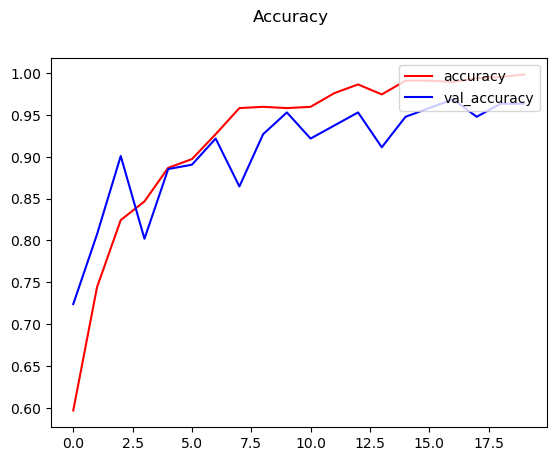
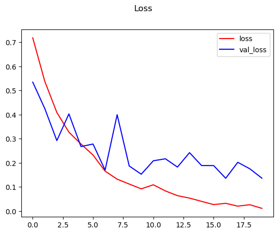

# Image-Classifier

This repository contains a Jupyter Notebook for building an image sentiment classifier using TensorFlow and Keras. The classifier is trained to distinguish between "happy" and "sad" images. It can be extended to classify more number of emotions.

## Table of Contents

- [Installation](#installation)
- [Usage](#usage)
- [Model Architecture](#model-architecture)
- [Training](#training)
- [Evaluation](#evaluation)
- [Testing](#testing)
- [Saving the Model](#saving-the-model)

## Installation

### Prerequisites

- Python 3.x
- Jupyter Notebook or Jupyter Lab

### Install Required Libraries

To run the notebook, you need to install the required libraries. Open a terminal and run the following commands:

```bash
pip install tensorflow==2.16.1
pip install opencv-python
pip install matplotlib
```

**Note**: The version of TensorFlow might change based on your operating system and Python version. Visit the [TensorFlow installation page](https://www.tensorflow.org/install) for more details.

## Usage

1. Clone this repository:

   ```bash
   git clone https://github.com/gojira69/Image-Classifier.git
   cd image-sentiment-classifier
   ```

2. Open the Jupyter Notebook:

   ```bash
   jupyter notebook imageSentimentClassifier.ipynb
   ```

3. Unzip the `Data.zip` folder to extract the required datasets.

4. Follow the steps in the notebook to preprocess data, build, train, and evaluate the model.

## Model Architecture

The model is built using TensorFlow and Keras, consisting of several convolutional layers followed by max-pooling layers and dense layers. The final layer uses a sigmoid activation function to output a binary classification.

### Model Layers

- Convolutional Layers (Conv2D)
- Max Pooling Layers (MaxPooling2D)
- Dense Layers
- Dropout Layers

The architecture is compiled with the `Adam` optimizer and `binary cross-entropy loss`.

## Training

### Data Cleanup

The notebook includes a data cleanup step to ensure all images in the dataset have valid image formats (jpeg, jpg, png, bmp).

### Model Compilation

The model is compiled using the `Adam` optimizer and `binary cross-entropy loss`. It includes `accuracy` as a metric.

```python
model.compile('adam', loss=tf.losses.BinaryCrossentropy(), metrics=['accuracy'])
```

### Training the Model

The model is trained for `20 epochs` using the training and validation datasets, with TensorBoard callback for logging.

```python
history = model.fit(train, epochs=20, validation_data=validation, callbacks=[tensorboard_callback])
```

## Evaluation

### Performance Analysis

The training and validation loss and accuracy are plotted to evaluate the model's performance.





### Precision, Recall, and Accuracy

The precision, recall, and accuracy are computed on the test dataset.

```python
Precision: 0.9411764740943909, Accuracy: 0.9375, Recall: 0.9599999785423279
```

## Testing

A test image is loaded and preprocessed, and the model predicts its sentiment.


```python
test_image = 'data/happy/friends-happy-190821.jpg'
img = cv2.imread(test_image)
resize = tf.image.resize(img, (256, 256))
plt.imshow(resize.numpy().astype(int))

y_pred = model.predict(np.expand_dims(resize/255, 0))

if y_pred > 0.5:
    print("Predicted category is Sad")
else:
    print("Predicted category is Happy")
```

```python
Output: Predicted category is Happy
```

## Saving the Model

The trained model is saved in `HDF5` format in the [models](/model) directory.
